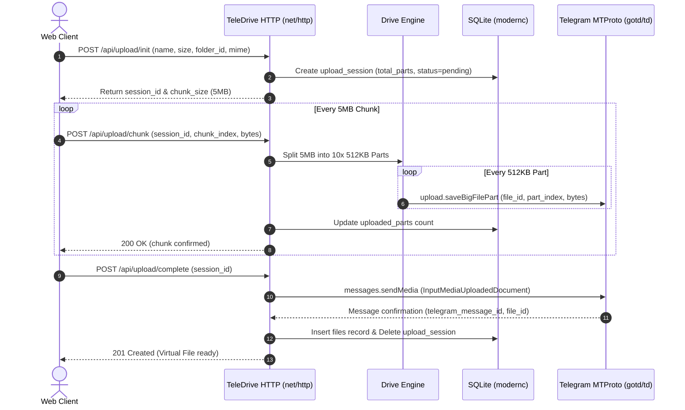
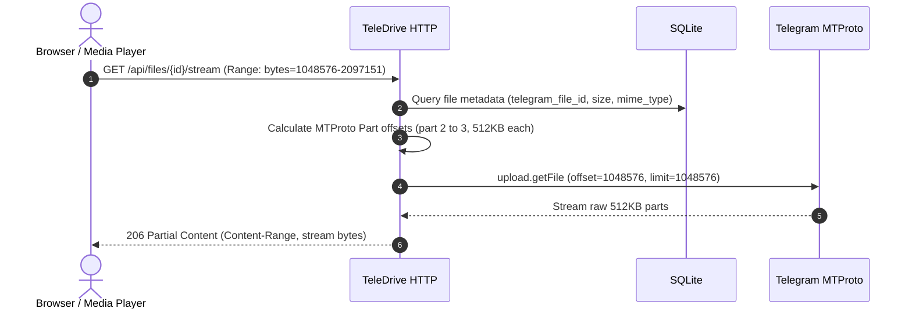
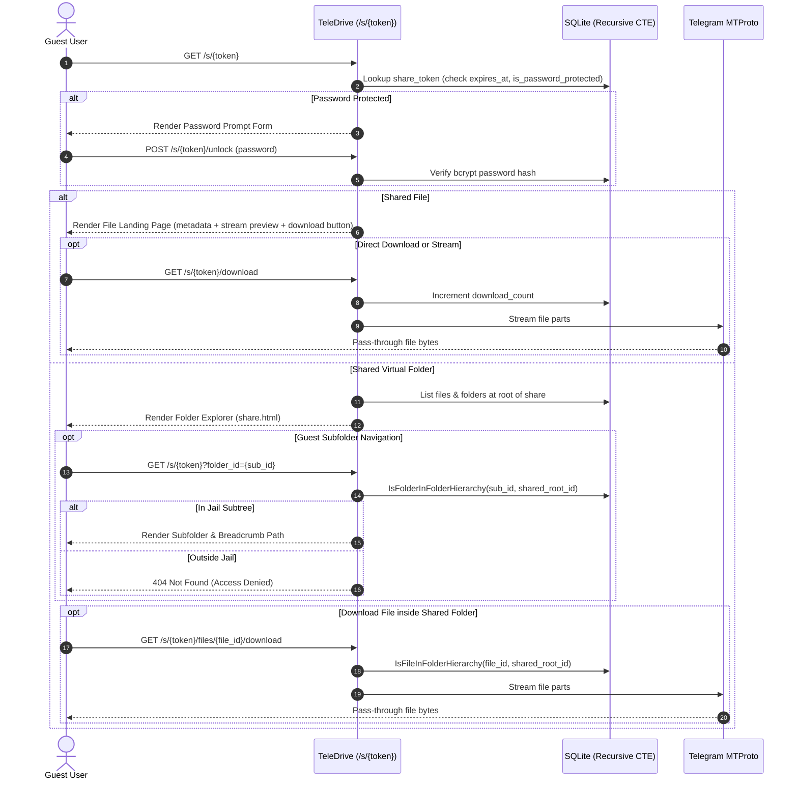
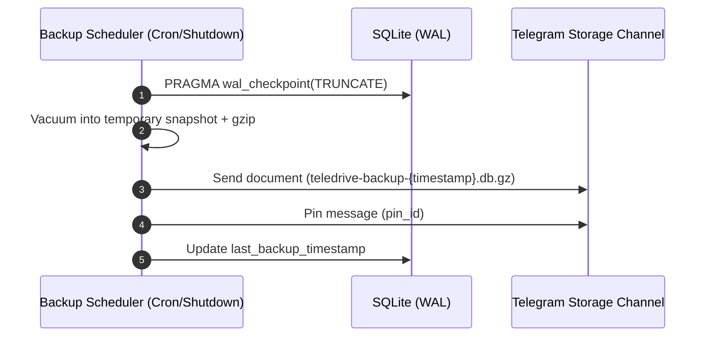
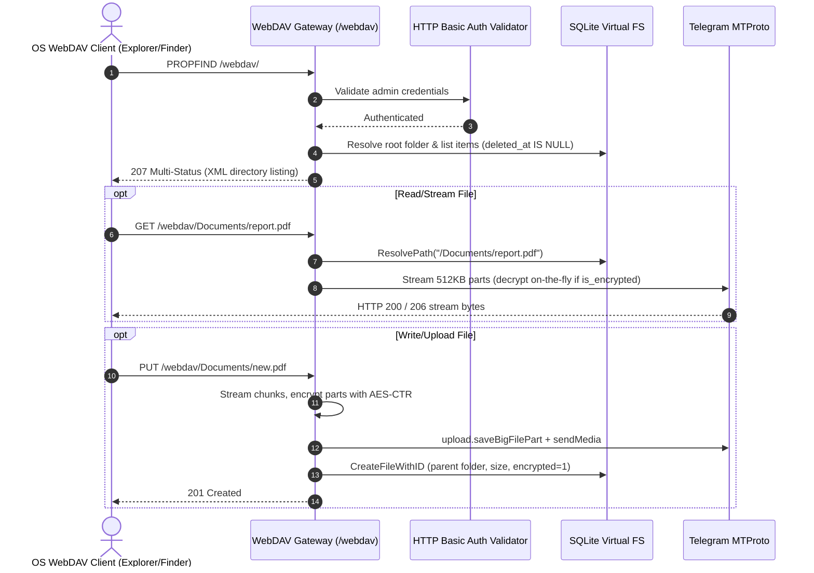
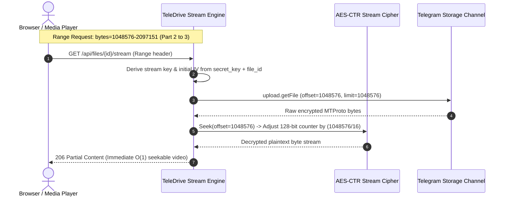
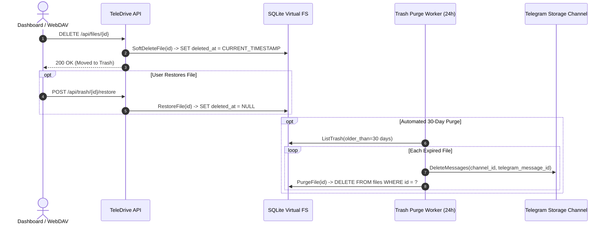
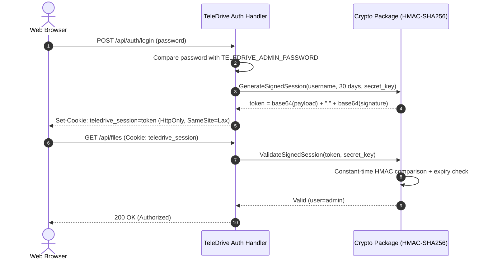
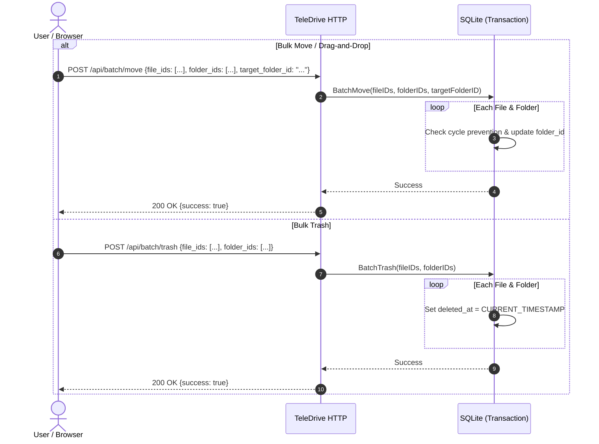

# TeleDrive Architecture

TeleDrive is a single-binary cloud storage system that bridges a web interface and virtual file system to Telegram's distributed cloud infrastructure via MTProto.

---

## 1. System Overview

```
+---------------------------------------------------------------------------------------------------+
|                                          TeleDrive Host                                           |
|                                                                                                   |
|  +--------------------+   +-----------------------+   +-------------------+   +----------------+  |
|  |  Web UI (Browser)  |   |  WebDAV Client (OS)   |   |   CLI Commands    |   | Share Visitor  |  |
|  | (Vanilla HTML/CSS) |   | (Win/macOS/davfs/rcl) |   | (upload/download) |   |  (/s/{token})  |  |
|  +--------------------+   +-----------------------+   +-------------------+   +----------------+  |
|            |                          |                         |                     |           |
|            v                          v                         v                     v           |
|  +--------------------+   +-----------------------+   +-------------------+   +----------------+  |
|  |  HTTP Web Handler  |   |    WebDAV Gateway     |   |   CLI Execution   |   | Share Handler  |  |
|  | (Signed HMAC-SHA)  |   | (Basic Auth /webdav)  |   |  (Local Secret)   |   | (Rate-Limited) |  |
|  +--------------------+   +-----------------------+   +-------------------+   +----------------+  |
|            |                          |                         |                     |           |
|            +--------------------------+------------+------------+---------------------+           |
|                                                    |                                              |
|                                                    v                                              |
|                                   +---------------------------------+                             |
|                                   |       Drive Core Engine         |                             |
|                                   | - Virtual Folder Tree & Trash   |                             |
|                                   | - Zero-Knowledge AES-CTR Stream |                             |
|                                   | - Resumable Upload Coordinator  |                             |
|                                   | - Range Request Streamer (206)  |                             |
|                                   +---------------------------------+                             |
|                                          |                   |                                    |
|                                          v                   v                                    |
|                             +----------------------+  +---------------------+                     |
|                             | SQLite Metadata (WAL)|  | Telegram MTProto    |                     |
|                             | - modernc.org/sqlite |  | - gotd/td client    |                     |
|                             | - Soft-delete Trash  |  | - 512KB Part Worker |                     |
|                             | - AES-GCM Sessions   |  | - FLOOD_WAIT Backoff|                     |
|                             +----------------------+  +---------------------+                     |
+------------------------------------------------------------------|--------------------------------+
                                                                   | MTProto TCP/TLS
                                                                   v
                                                     +---------------------------+
                                                     | Telegram Cloud Platform   |
                                                     | (Storage Channel Vault)   |
                                                     +---------------------------+
```

---

## 2. Core Workflows

### 2.1 Resumable Upload Flow

The client browser slices large files into 5 MB–10 MB **Chunks**. TeleDrive receives each chunk, slices it into 512 KB MTProto **Parts**, streams them directly to Telegram via `gotd/td`, and tracks the upload session in SQLite.



---

### 2.2 Download & Media Streaming Flow (HTTP 206 Range)

To preview videos or resume partial downloads, TeleDrive translates HTTP byte-range requests directly into MTProto part offsets without buffering the entire file.



---

### 2.3 Share Link Flow & Virtual Folder Jailing

Public visitors access files or folders via cryptographic tokens. Passwords and expiry are validated at the edge before rendering content or streaming bytes. For shared folders, recursive CTE boundary checks prevent guest escape from the shared subtree.



---

### 2.4 Disaster Recovery & Backup Flow

The SQLite database is backed up to the dedicated Storage Channel periodically and on shutdown.



---

### 2.5 WebDAV Gateway Flow

TeleDrive implements `golang.org/x/net/webdav.FileSystem` over SQLite and MTProto, permitting native OS mounting (Windows Explorer, macOS Finder, Linux `davfs2`, `rclone`) via standard HTTP Basic Authentication.



---

### 2.6 Zero-Knowledge Seekable Stream Encryption Flow

To prevent Telegram or intermediate proxies from inspecting content while preserving real-time video seeking, TeleDrive uses AES-128/256-CTR with 1-to-1 byte parity and zero size expansion.



---

### 2.7 Virtual Trash Staging & Automated Purge Flow

Deletions do not destroy data instantly. Soft-deleted items are marked with `deleted_at`, hidden from active views and WebDAV, and permanently purged after 30 days.



---

### 2.8 HMAC-SHA256 Signed Session Flow

Stateless, tamper-proof session tokens authenticate web requests without requiring server-side session table lookups.



---

### 2.9 Bulk Operations & Drag-and-Drop Organization Flow

TeleDrive provides high-throughput batch operations for desktop-style file organization via drag-and-drop or multi-selection.



---

## 3. Database Schema (SQLite)

```sql
-- Virtual Folder hierarchy
CREATE TABLE folders (
    id TEXT PRIMARY KEY,
    parent_id TEXT NULL REFERENCES folders(id) ON DELETE CASCADE,
    name TEXT NOT NULL,
    created_at DATETIME DEFAULT CURRENT_TIMESTAMP,
    updated_at DATETIME DEFAULT CURRENT_TIMESTAMP,
    deleted_at DATETIME NULL
);
CREATE INDEX idx_folders_parent ON folders(parent_id);
CREATE INDEX idx_folders_deleted ON folders(deleted_at);

-- Virtual Files mapped to Telegram objects
CREATE TABLE files (
    id TEXT PRIMARY KEY,
    folder_id TEXT NULL REFERENCES folders(id) ON DELETE SET NULL,
    name TEXT NOT NULL,
    size INTEGER NOT NULL,
    mime_type TEXT NOT NULL,
    telegram_message_id INTEGER NOT NULL,
    telegram_file_id TEXT NOT NULL,
    telegram_access_hash TEXT NOT NULL,
    sha256 TEXT,
    is_encrypted INTEGER DEFAULT 0,
    created_at DATETIME DEFAULT CURRENT_TIMESTAMP,
    updated_at DATETIME DEFAULT CURRENT_TIMESTAMP,
    deleted_at DATETIME NULL
);
CREATE INDEX idx_files_folder ON files(folder_id);
CREATE INDEX idx_files_name ON files(name);
CREATE INDEX idx_files_deleted ON files(deleted_at);

-- In-flight resumable upload sessions
CREATE TABLE upload_sessions (
    id TEXT PRIMARY KEY,
    folder_id TEXT REFERENCES folders(id),
    name TEXT NOT NULL,
    size INTEGER NOT NULL,
    mime_type TEXT NOT NULL,
    total_parts INTEGER NOT NULL,
    uploaded_parts INTEGER DEFAULT 0,
    telegram_file_id INTEGER NOT NULL, -- gotd random ID
    created_at DATETIME DEFAULT CURRENT_TIMESTAMP
);

-- Public share links (files or folders)
CREATE TABLE share_links (
    id TEXT PRIMARY KEY,
    token TEXT UNIQUE NOT NULL,
    file_id TEXT NULL REFERENCES files(id) ON DELETE CASCADE,
    folder_id TEXT NULL REFERENCES folders(id) ON DELETE CASCADE,
    password_hash TEXT NULL,
    expires_at DATETIME NULL,
    download_count INTEGER DEFAULT 0,
    max_downloads INTEGER NULL,
    created_at DATETIME DEFAULT CURRENT_TIMESTAMP
);
CREATE INDEX idx_share_token ON share_links(token);

-- Encrypted Telegram MTProto session & system settings
CREATE TABLE settings (
    key TEXT PRIMARY KEY,
    value TEXT NOT NULL,
    updated_at DATETIME DEFAULT CURRENT_TIMESTAMP
);
```

---

## 4. Source Directory Structure

Following the Ponytail principle (minimal files, zero unnecessary abstractions):

```
teledrive/
├── CONTEXT.md
├── ARCHITECTURE.md
├── SECURITY.md
├── MILESTONES.md
├── docs/
│   ├── USER_GUIDE.md
│   ├── assets/
│   │   └── teledrive-login.png
│   └── adr/
│       ├── 0001-storage-channel-target.md
│       ├── 0002-pure-go-mtproto-client.md
│       ├── 0003-pass-through-streaming.md
│       ├── 0004-modernc-sqlite-pure-go.md
│       ├── 0005-stdlib-net-http.md
│       ├── 0006-chunked-resumable-http-upload.md
│       ├── 0007-aes-gcm-session-encryption.md
│       ├── 0008-primary-account-tos-safe-mode.md
│       ├── 0009-zero-build-embedded-modern-ui.md
│       ├── 0010-database-snapshots-and-rolling-retention.md
│       ├── 0011-npm-distribution-wrapper.md
│       ├── 0012-signed-session-token.md
│       ├── 0013-zero-knowledge-seekable-stream-encryption.md
│       └── 0014-embedded-webdav-gateway.md
├── bin/
│   └── teledrive.js             # Zero-dependency npm launcher wrapper
├── cmd/
│   └── teledrive/
│       ├── main.go              # CLI router (server, login, upload, list, backup)
│       └── commands.go          # Subcommand implementations
├── internal/
│   ├── app/
│   │   └── config.go            # Minimal configuration loader
│   ├── crypto/
│   │   ├── aes.go               # AES-256-GCM encryption helpers (session string)
│   │   ├── session.go           # HMAC-SHA256 signed session tokens
│   │   └── stream.go            # AES-CTR seekable stream cipher (zero-knowledge)
│   ├── db/
│   │   ├── db.go                # SQLite init (WAL mode & schema migrations)
│   │   ├── files.go             # Virtual folder, file, trash, and VFS CRUD
│   │   └── backup.go            # Snapshot export & restore
│   ├── telegram/
│   │   ├── client.go            # gotd/td connection manager
│   │   ├── auth.go              # CLI interactive login wizard
│   │   ├── uploader.go          # 512KB MTProto part uploader
│   │   ├── downloader.go        # Range-aware MTProto part streamer (with decryptor)
│   │   └── limiter.go           # FloodWait backoff & rate queue
│   └── web/
│       ├── server.go            # net/http ServeMux routes & middleware
│       ├── handlers_drive.go    # File/folder operations & downloads/streams
│       ├── handlers_upload.go   # Resumable chunked upload endpoints
│       ├── handlers_trash.go    # Virtual trash restore, empty, and auto-purge
│       ├── handlers_share.go    # Public /s/{token} & /api/shares management
│       ├── handlers_snapshot.go # Web snapshot history & restore
│       ├── webdav.go            # WebDAV FileSystem bridge (/webdav)
│       └── static/              # Embedded UI assets (CSS design tokens, Lucide SVG, Vanilla JS)
├── package.json                 # npm metadata & bin entry
├── go.mod
└── go.sum
```
